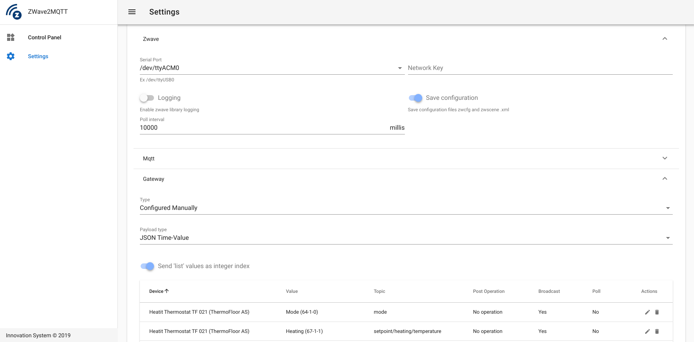
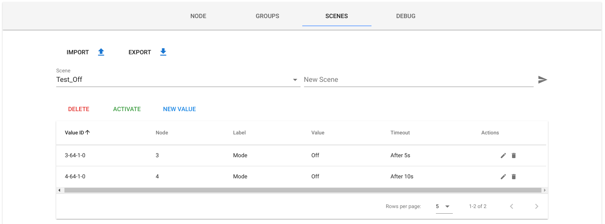
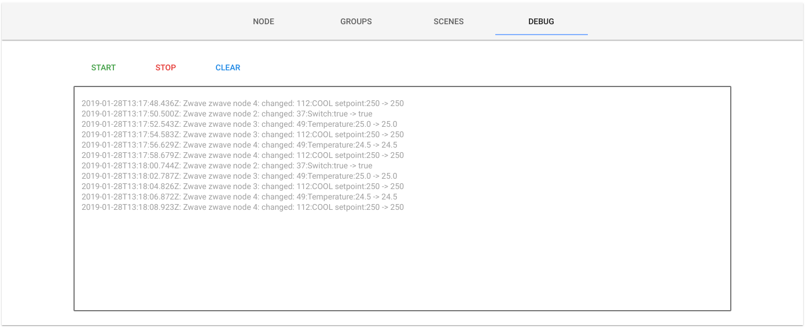

# Zwave To MQTT

[](http://makeapullrequest.com)
[](https://opensource.org/licenses/mit-license.php)
[](https://hub.docker.com/r/robertslando/zwave2mqtt)
[](https://hub.docker.com/r/robertslando/zwave2mqtt)
[](https://hub.docker.com/r/robertslando/zwave2mqtt "Get your own image badge on microbadger.com")


**TO**


Fully configurable Zwave to MQTT **Gateway** and **Control Panel**.

- **Backend**: NodeJS, Express, socket.io, Mqttjs, openzwave-shared, Webpack
- **Frontend**: Vue,  socket.io, [Vuetify](https://github.com/vuetifyjs/vuetify)

## :electric_plug: Installation

### :tada: DOCKER way

Check [docker repo](https://github.com/robertsLando/Zwave2Mqtt-docker#install) for more info

```bash
# Using volumes as persistence
docker run --rm -it -p 8091:8091 --device=/dev/ttyACM0 --mount source=zwave2mqtt,target=/usr/src/app/store robertslando/zwave2mqtt:latest

# Using local folder as persistence
mkdir store
docker run --rm -it -p 8091:8091 --device=/dev/ttyACM0 -v $(pwd)/store:/usr/src/app/store robertslando/zwave2mqtt:latest
```

> Replace `/dev/ttyACM0` with your serial device

Enjoy :smile:

### NodeJS or PKG version

1. Firstly you need to install [Open-Zwave](https://github.com/OpenZWave/open-zwave) library on your system.

    If you are using Ubuntu:

    ```sh
    sudo apt-get install libudev-dev
    cd ~
    wget http://old.openzwave.com/downloads/openzwave-1.4.1.tar.gz
    tar zxvf openzwave-*.gz
    cd openzwave-* && make && sudo make install
    export LD_LIBRARY_PATH=/usr/local/lib64
    sudo sed -i '$a LD_LIBRARY_PATH=/usr/local/lib64' /etc/environment
    ```

    For Raspberry check [here](https://github.com/OpenZWave/node-openzwave-shared/blob/master/README-raspbian.md#2-install-the-open-zwave-library-on-your-raspberry)

2. Test the library: go to openzwave directory `cd openzwave-*` and run the command

    `MinOZW /dev/ttyACM0`

    > replace `/dev/ttyACM0` with the USB port where your controller is connected

3. Now you can use the packaged version (you don't need NodeJS/npm installed) or clone this repo and build the project:

    - For the packaged version:

       ```sh
       cd ~
       mkdir Zwave2Mqtt
       cd Zwave2Mqtt
       wget https://github.com/OpenZWave/Zwave2Mqtt/releases/download/1.0.0/zwave2mqtt-v1.0.0.zip
       unzip zwave2mqtt-v1.0.0_PKG.zip
       ./zwave2mqtt
       ```

    - If you want to compile last code from github:

      ```sh
      git clone https://github.com/OpenZWave/Zwave2Mqtt
      cd Zwave2Mqtt
      npm install
      npm run build
      npm start
      ```

4. Open the browser <http://localhost:8091>

## :nerd_face: Development

Developers who wants to debug the application have to open 2 terminals.

In first terminal run `npm run dev` to start webpack-dev for front-end developing and hot reloading at <http://localhost:8092>
(**THE PORT FOR DEVELOPING IS 8092**)

In the second terminal run `npm run dev:server` to start the backend server with inspect and auto restart features (if you don't have nodemon installed: `npm install -g nodemon`)

To package the application run `npm run pkg` command and follow the steps

## :wrench: Usage

Firstly you need to open the browser at the link <http://localhost:8091> and edit the settings for Zwave, MQTT and the Gateway.

### Zwave

Zwave settings:

- **Serial port**: The serial port where your controller is connected
- **Network key** (Optional): Zwave network key if security is enabled
- **Logging**: Enable/Disable Openzwave Library logging
- **Save configuration**: Store zwave configuration in `zwcfg_<homeHex>.xml` and `zwscene.xml` files this is needed for peristent node information like node name and location
- **Poll interval**: Interval in milliseconds between polls
- **Configuration Path**: The path to Openzwave devices config db
- **Assume Awake**: Assume Devices that support the Wakeup Class are awake when starting up OZW

### MQTT

Mqtt settings:

- **Name**: A unique name that identify the Gateway.
- **Host**: The url of the broker. Insert here the protocol if present, example: `tls://localhost`. Mqtt supports this protocols:  `mqtt`, `mqtts`, `tcp`, `tls`, `ws`, `wss`. At the moment `wss` and `mqtts` protocols are not supported because they require cert and key files
- **Port**: Broker port
- **Reconnect period**: Milliseconds between two reconnection tries
- **Prefix**: The prefix where all values are published
- **QoS**: Quality Of Service (check MQTT specs) of outgoing packets
- **Retain**: The retain flag of outgoing packets
- **Clean**: Sets the clean flag when connecting to the broker
- **Store**: Enable/Disable persistent storage of packets (QoS > 0). If disabled in memory storage will be used but all packets stored in memory are lost in case of shutdowns or unexpected errors.
- **Allow self signed certs**: When using encrypted protocols, set this to true to allow self signed certificates (**WARNING** this could expose you to man in the middle attacks)
- **Auth**: Enable this if broker requires auth. If so you need to enter also a valid **username** and **password**.

### Gateway

Gateway settings:

- **Gateway type**: This setting specify the logic used to publish Zwave Nodes Values in MQTT topics. At the moment there are 3 possible configuration, two are automatic (all values are published in a specific topic) and one needs to manually configure which values you want to publish to MQTT and what topic to use. For every gateway type you can set custom topic values, if gateway is not in 'configure manually' mode you can omit the topic of the values (the topic will depends on the gateway type) and use the table to set values you want to `poll` or if you want to scale them using `post operation`

  1. **ValueId Topics**: *Automatically configured*. The topic where zwave values are published will be:

      `<mqtt_prefix>/<?node_location>/<node_id>/<class_id>/<instance>/<index>`

      - `mqtt_prefix`: the prefix set in Mqtt Settings
      - `node_location`: location of the Zwave Node (optional, if not present will not be added to the topic)
      - `node_id`: the unique numerical id of the node in Zwave network
      - `class_id`: the numerical class id of the value
      - `instance`: the numerical value of value instance
      - `index`: the numerical index of the value

  2. **Named Topics**: *Automatically configured*. The topic where zwave values are published will be:

      `<mqtt_prefix>/<?node_location>/<node_name>/<class_name>/<?instance>/<value_label>`

      - `mqtt_prefix`: the prefix set in Mqtt Settings
      - `node_location`: location of the Zwave Node (optional, if not present will not be added to the topic)
      - `node_name`: name of the node, if not set will be `nodeID_<node_id>`
      - `class_name`: the node class name corrisponding to given class id or `unknownClass_<class_id>` if the class name is not found
      - `?instance`: Used just with multi-instance devices. The main instance (1) will not have this part in the topic but other instances will have: `instance_<instance_index>`
      - `value_label`: the zwave value label (lower case and spaces are replaced with `_`)

  3. **Configured Manually**: *Needs configuration*. The topic where zwave values are published will be:

      `<mqtt_prefix>/<?node_location>/<node_name>/<value_topic>`

      - `mqtt_prefix`: the prefix set in Mqtt Settings
      - `node_location`: location of the Zwave Node (optional, if not present will not be added to the topic)
      - `node_name`: name of the node, if not set will be `nodeID_<node_id>`
      - `value_topic`: the topic of the value. This is manually configured in Gateway settings by popolating a table with the values that I want to read from each device of a specific type in my network. Once scan is complete, the gateway creates an array with all devices types found in the network. A device has a `device_id` that is unique, it is composed by this node properties: `<manufacturerid>-<productid>-<producttype>`.

- **Payload type**: The content of the payload when an update is published:
  - **JSON Time-Value**: The payload will be a JSON object like:

    ```json
    {
      "time": 1548683523859,
      "value": 10
    }
    ```

  - **Entire Zwave value Object**
  The payload will contain all info of a value from Zwave network:

      ```json
      {
        "value_id": "3-64-1-0",
        "node_id": 3,
        "class_id": 64,
        "type": "list",
        "genre": "user",
        "instance": 1,
        "index": 0,
        "label": "Mode",
        "units": "",
        "help": "",
        "read_only": false,
        "write_only": false,
        "min": 0,
        "max": 0,
        "is_polled": false,
        "values": ["Off", "Heat (Default)", "Cool", "Energy Heat"],
        "value": "Off",
      }
      ```

  - **Just value**: The payload will contain only the row Numeric/String value

- **Send 'list' as integer**: Zwave 'list' values are sent as list index instead of string values

Once finished press `SAVE` and gateway will start Zwave Network Scan, than go to 'Control Panel' section and wait until the scan is completed to check discovered devices and manage them.

Settings, scenes and Zwave configuration are stored in `JSON/xml` files under project `store` folder that you can easily **import/export** for backup purposes.

By default Node status (`true` if node is ready `false` if node is dead) will be published in:

`<mqtt_prefix>/<?node_location>/<node_name>/status`

#### Nodes Management

To add a node using the UI select the controller Action `Add Node (inclusion)`, click send (:airplane:) button to enable the inclusion mode in your controller and enable the inclusion mode in your device to. `Controller status` will be `waiting` when inclusion has been successfully enabled on the controller and `completed` when the node has been successfully added. Wait few seconds and your node will be visible in the table once ready.

To add a node using the UI select the controller Action `Remove Node (exlusion)`, click send (:airplane:) button to enable the exclusion mode in your controller and enable the exclusion mode in your device to. `Controller status` will be `waiting` when exclusion has been successfully enabled on the controller and `completed` when the node has been successfully removed. Wait few seconds and your node will be removed from the table.

To replace a failed node using the UI you have to check if the Node is failed using `Has node failed` command. If Controller status says `NodeFailed` the node can be replaced, if not controller will say `NodeOk`. Sometimes to update node state and make it failed you firstly need to send `Update return route` command than send `Has node failed` and check if the status now is `NodeFailed`. If so you can replace the node using the command `Replace Failed Node`, now the controller will start inclusion mode and status will be `Waiting`, now enable inclusion on your device to add it to the network by replacing the failed one.

## :star: Features

- Configurable Zwave to Mqtt Gateway
- Zwave Control Panel:
  - **Nodes management**: check nodes status in the network, change nodes `name` and `location`, get nodes values and configure them, send actions to controller and import/export zwave configuration files
  - **Groups associations**: create associations between nodes (also supports multi-instance associations, need to use last version of openzwave-shared)
  - **Custom scenes management**: (OpenZwave-Shared scenes management has actually some bugs and it's limited so I have made a custom scenes implementation that uses the same APIs but stores values in a JSON file that can be imported/exported and also allows to set a timeout to a value in a scene)
- Log debug in UI

## :gift: MQTT APIs

You have full access to all [Openzwave-Shared APIs](https://github.com/OpenZWave/node-openzwave-shared/blob/master/README-api.md) (and more) by simple usign MQTT.

### Zwave APIs

To call a Zwave API you just need to publish a JSON object like:

```json
{
  "args": [2,1]
}
```

Where `args` is an array with the args used to call the api, the topic is:

`<mqtt_prefix>/_CLIENTS/ZWAVE_GATEWAY-<mqtt_name>/api/<api_name>/set`

The result will be publised on the same topic without `/set`

Example: If I publish the previous json object to the topic

`zwave/_CLIENTS/ZWAVE_GATEWAY-office/api/getAssociations/set`

I will get this response (in the same topic without the suffix `/set`):

```json
{
  "success":true,
  "message":"Success zwave api call",
  "result":[1]
}
```

`result` will contain the value returned from the API. In this example I will get an array with all node IDs that are associated to the group 1 (lifeline) of node 2.

### Set values

To write a value using MQTT you just need to send the value to set in the same topic where the value updates are published by adding the suffix `/set` to the topic (**READONLY VALUES CANNOT BE WRITE**).

Example with gateway configured with `named topics`:

If I publish the value `25.5` (also a payload with a JSON object with the value in `value` property is accepted) to the topic

`zwave/office/nodeID_4/thermostat_setpoint/heating/set`

I will set the Heating setpoint of the node with id `4` located in the `office` to `25.5`. To check if the value has been successfully write just check when the value changes on the topic:

`zwave/office/nodeID_4/thermostat_setpoint/heating`

### Broadcast

You can send broadcast values to *all values with a specific suffix* in the network.

Broadcast API is accessible from:

`<mqtt_prefix>/_CLIENTS/ZWAVE_GATEWAY-<mqtt_name>/broadcast/<value_topic_suffix>/set`

- `value_topic_suffix`: the suffix of the topic of the value I want to control using broadcast.

It works like the set value API without the node name and location properties.
If the API is correctly called the same payload of the request will be published
to the topic without `/set` suffix.

Example of broadcast command (gateway configured as `named topics`):

`zwave/_CLIENTS/ZWAVE_GATEWAY-test/broadcast/thermostat_setpoint/heating/set`

Payload: `25.5`

All nodes with command class `thermostat_setpoint` and value `heating` will be set to `25.5` and I will get the same value on the topic:

`zwave/_CLIENTS/ZWAVE_GATEWAY-test/broadcast/thermostat_setpoint/heating`

## :camera: Screenshots

### Settings



### Control Panel


### Groups associations


### Scenes



### Debug



## :pencil: TODOs

- [x] Better logging
- [x] Dockerize application
- [x] Package application with PKG
- [ ] Add unit test
- [ ] JSON validator for settings and scenes
- [ ] Better nodes status management using 'testNode'
- [ ] Network graph to show neightborns using [vue-d3-network](https://github.com/emiliorizzo/vue-d3-network)

## :bowtie: Author

[Daniel Lando](https://github.com/robertsLando)

Support me on [Patreon](https://www.patreon.com/join/2409916) :heart:
